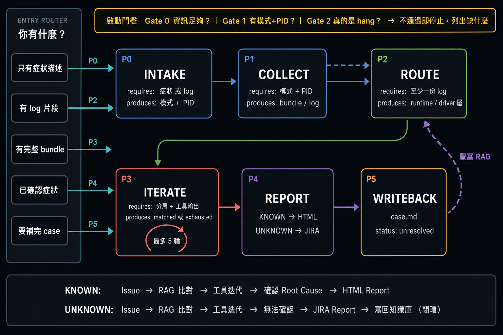

# rockit

AMD GPU hang 診斷工具庫 + 雙層知識庫。在 Cursor 中開啟此 project，描述問題即可獲得診斷建議。

## 閉環診斷流程



### 工具選擇順序

每一輪迭代中，agent 按症狀推薦的優先順序逐一選擇工具：

| Runtime 層 | Driver / GPU 層 |
|-----------|-----------------|
| 1. rocgdb batch attach | 1. 手動: amdgpu_fence_info |
| 2. HIPER (HIP API 錄製) | 2. dump_kfd_snapshots.sh |
| 3. ROCm Debug Agent | 3. dump_sdma_registers.sh |
| | 4. 手動: dyndbg + rls/hqds/mqds |

### 兩種 Report 輸出

- **KNOWN → HTML Report**：Root cause SVG flowchart + 修復方案 + 相關 case 引用
- **UNKNOWN → JIRA Report**（markdown，可直接貼 JIRA）：環境、log 摘要、已排除可能性、疑似 root cause、建議下一步。自動寫回 `knowledge/{layer}/cases/`，標記 `status: unresolved`

## 快速開始

### 1. 遇到 GPU hang，先跑初始收集

```bash
sudo ./tools/collect_hang_info.sh all
```

### 2. 在 Cursor 中開啟此 project，描述問題

```
GPU 卡住了，dmesg 有 sdma timeout，process 卡在 hipMemcpy
```

AI 會自動走上面的閉環流程。

### 3. 或直接觸發診斷 skill

```
幫我診斷這個 GPU hang 問題
```

## 目錄結構

```
gpu-debug-toolkit/
├── .cursor/
│   ├── rules/                     # AI 行為規則
│   │   ├── project.mdc            # 全域規則 + 雙層路由
│   │   ├── diagnose.mdc           # 症狀診斷流程
│   │   ├── recommend-tool.mdc     # 工具推薦邏輯
│   │   └── interpret-log.mdc      # Log 解讀規則
│   └── skills/
│       └── diagnose/SKILL.md      # 閉環診斷 skill（5 輪迭代 + 雙出口）
│
├── tools/                         # 診斷工具腳本
│   ├── collect_hang_info.sh       # 一次性收集所有診斷資料
│   ├── dump_kfd_snapshots.sh      # KFD debugfs 多輪快照 + fence diff
│   ├── dump_sdma_registers.sh     # SDMA 暫存器完整 dump
│   ├── manual_commands.md         # 手動命令參考 (fence_info, dyndbg)
│   ├── rocgdb_cheatsheet.md       # rocgdb 常用命令速查
│   ├── debug_agent_guide.md       # ROCm Debug Agent 指南
│   └── _coverage.md               # 工具覆蓋對照表
│
├── knowledge/                     # 雙層知識庫 (RAG)
│   ├── _index.md                  # 總索引 + 層級路由
│   ├── runtime/                   # CLR (HIP) + ROCR (HSA)
│   │   ├── _index.md
│   │   ├── symptoms/              # waitrelaxed_hang, hipfree_stall, ...
│   │   ├── playbooks/             # general_hang_triage
│   │   └── cases/                 # d2h_perm_hang, alibaba_waitrelaxed
│   └── driver/                    # KFD driver + GPU hardware
│       ├── _index.md
│       ├── symptoms/              # sdma_fence_stuck, rdma_pin_rejected, ...
│       ├── playbooks/             # sdma_fence_debug, timeout_death_map, ...
│       └── cases/                 # alibaba_rdma_underflow, sdma_fence_evidence
│
└── README.md                      # 本文件
```

## 工具速覽

| 工具 | 層級 | 用途 |
|------|------|------|
| collect_hang_info.sh | 全層 | 任何 hang 的第一步 |
| dump_kfd_snapshots.sh | KFD/Driver | fence diff + KFD queue 詳細 |
| dump_sdma_registers.sh | GPU HW | SDMA 暫存器完整 dump |
| rocgdb | CLR + ROCR + GPU | CPU/GPU thread debug + wave |
| HIPER | CLR | HIP API 錄製 + replay |
| Debug Agent | ROCR + GPU | crash/fault 自動診斷 |

## 如何新增知識

### 新增症狀
1. 在 `knowledge/{runtime|driver}/symptoms/` 建 `.md`（按統一 frontmatter 格式）
2. 更新該層的 `_index.md` 速查表加一行

### 新增案例
1. 在 `knowledge/{runtime|driver}/cases/` 建目錄
2. 放入 `case.md`（含 frontmatter: status, root_cause, tools_used）+ 標註 log
3. 跨層問題：root cause 放主層，另一層建 cross-ref case

### 新增工具
1. 腳本放進 `tools/`
2. 更新 `tools/_coverage.md`

### UNKNOWN → KNOWN 轉換
問題解決後：
1. 將 case.md 的 `status: unresolved` 改為 `resolved`
2. 補上 root_cause 和 fix 欄位
3. 若是新症狀類型，在 `symptoms/` 建對應條目
