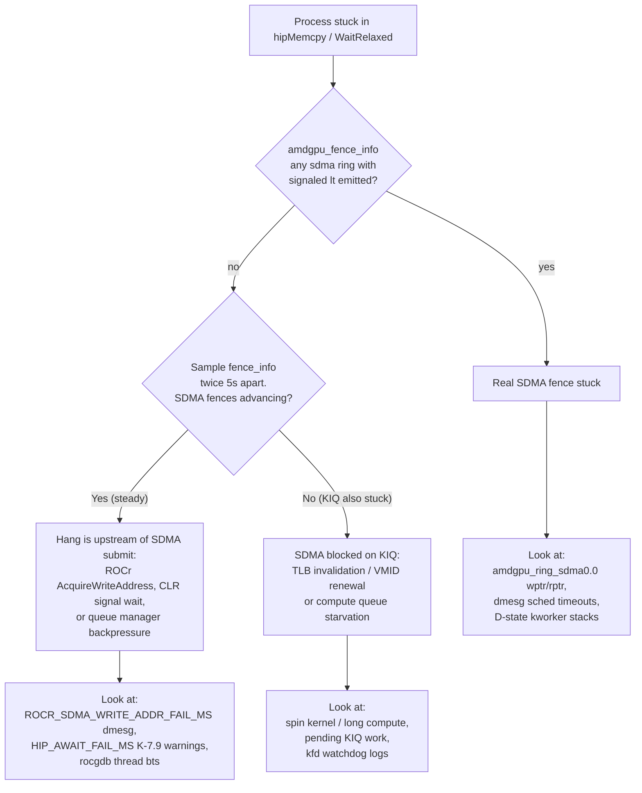

# SDMA Fence Debug Playbook

**Last updated**: 2026-05-06 (during v17.5-rc3-candidate validation)
**Purpose**: How to confirm whether a "hang" really is an SDMA fence timeout
in the kernel driver, vs. a userspace-side stall that only *looks like* one.

This skill was developed in response to a customer-reported "SDMA fence
timeout" on `customer_hang_repro`. After applying this playbook, we proved
the hang is **not** an SDMA fence timeout (driver-side fences fire fine);
the actual chain is documented in `docs/HANG_VULN_ANALYSIS.md`.

---

## Quick decision tree



---

## 1. The two-line evidence

For each amdgpu card (8 GPUs on MI300X = `/sys/kernel/debug/dri/{1,9,17,25,33,41,49,57}`):

```bash
sudo cat /sys/kernel/debug/dri/<card>/amdgpu_fence_info
```

Output per ring looks like:

```
--- ring 36 (sdma0.0) ---
Last signaled fence          0x0001cee4
Last emitted                 0x0001cee4
Last signaled trailing fence 0x00000000
Last emitted                 0x00000000
```

**`Last signaled fence` vs the FIRST `Last emitted`** — these are the
ring-level counters. Per-ring rule:

| Condition | Meaning |
|---|---|
| `signaled == emitted` | All in-flight fences on this ring have completed; ring is healthy |
| `signaled < emitted` | `(emitted - signaled)` fences submitted but not yet signaled — pending in-flight or stuck |

**Persistent `signaled < emitted` across multiple snapshots = real stuck SDMA fence.**

The second `Last emitted` line is the trailing-fence counter (always 0 in
healthy state); ignore it for the pending check.

---

## 2. Snapshot script

Capture all amdgpu cards + tag each snapshot with a label:

```bash
#!/bin/bash
# /tmp/snap_fence.sh <tag>
TAG=$1
OUT=/tmp/fence_snaps
mkdir -p $OUT
TS=$(date +%H%M%S.%N | head -c 12)
for c in 1 9 17 25 33 41 49 57; do
  sudo cat /sys/kernel/debug/dri/$c/amdgpu_fence_info \
    > $OUT/card${c}_${TAG}_${TS}.txt 2>/dev/null
done
echo "$TAG @ $TS captured"
```

Take snapshots before, during, and after the suspect operation.

---

## 3. Pending-fence parser (correct one — the obvious one is wrong)

Wrong (matches the trailing-fence "Last emitted" line and reports false positives):

```awk
/^--- ring/ { ring=$0 }
/Last signaled fence/ { sig=$NF }
/Last emitted/ { emit=$NF; if (sig != emit) print ring, sig, emit }
```

Correct (only the FIRST `Last emitted` after each ring header):

```awk
/^--- ring/   { ring=$0; sig=""; emit=""; got_sig=0 }
/Last signaled fence/  { sig=$NF; got_sig=1 }
got_sig && /Last emitted/ {
    emit=$NF
    if (sig != emit)
        printf "%s sig=%s emit=%s pending=%d\n",
               ring, sig, emit, strtonum(emit) - strtonum(sig)
    got_sig=0   # only consume the first "Last emitted" per ring
}
```

This bug bit me on the first pass — every ring looked "stuck" because the
trailing-fence "Last emitted" is `0x00000000` while the signaled is some
real value. **Always verify with the awk above.**

---

## 4. Quantify advance rate (the most informative single check)

Take three snapshots ~5s apart during the suspect window, then compute
fence increments per ring:

```bash
T0=$(ls /tmp/fence_snaps/card1_t0_baseline_*.txt | head -1)
T1=$(ls /tmp/fence_snaps/card1_t1_mid_*.txt | head -1)
T2=$(ls /tmp/fence_snaps/card1_t2_late_*.txt | head -1)
for ring in sdma0.0 sdma0.1 sdma1.2 sdma1.3 comp_0.1.0.0 kiq_0.2.1.0; do
  for f in $T0 $T1 $T2; do
    val=$(grep -A1 "$ring" "$f" | grep "Last signaled" | head -1 | awk '{print $NF}')
    label=$(basename $f | cut -d_ -f3-4)
    printf "  %-15s %-25s = %s\n" "$ring" "$label" "$val"
  done
  echo
done
```

What the patterns mean:

| Ring pattern | Diagnosis |
|---|---|
| sdma fence increments steady (e.g. +50 per 5s) | SDMA healthy, hang is upstream of SDMA submit |
| sdma fence advances at t0->t1 then 0 at t1->t2 | SDMA went idle mid-run — submitter stopped feeding it |
| sdma fence already non-zero pending at t0 + same delta at t1 + same at t2 | Real SDMA HW stall, fence stuck |
| compute (`comp_*`) stuck at 0x1 | Spin kernel monopolising compute (intentional in poison reproducers) |
| KIQ (`kiq_*`) stops advancing in sync with SDMA stop | SDMA waiting on KIQ for TLB / VMID — not a fence problem |

---

## 5. Real evidence collected (2026-05-06)

`customer_hang_repro` + `device_sync_hang` under cgroup=32GB, with rc2
stock CLR (= reproduces customer hang signature):

```
GPU0 sdma0.0:  baseline=0x1cee4  d2d_flood=0x1cf2c (+72)  late_flood=0x1cf2c (+0)
GPU0 sdma0.1:  baseline=0x015c4  d2d_flood=0x015c8 (+4)   late_flood=0x015c8 (+0)
GPU0 sdma1.2:  baseline=0x004dd  d2d_flood=0x004e5 (+8)   late_flood=0x004e9 (+4)
GPU0 KIQ:      baseline=0x031ac  d2d_flood=0x031c5 (+25)  late_flood=0x031c5 (+0)
GPU0 comp_0:   0x00000001 throughout (spin kernel never exits — by design)
```

Across all 8 GPUs and all 8 SDMA rings × 6 snapshots = **0 ring with
persistent `signaled < emitted`**. Conclusion: the customer hang scenario
**does not stuck SDMA fences**. The chain is:

1. Reproducer launches a spin kernel that never exits (occupies compute)
2. KIQ gets backpressured (shared queue manager / GPU resources)
3. SDMA cannot get TLB invalidate / VMID renewal from KIQ
4. SDMA goes idle (rings stop advancing) but no fence is stuck — there is
   nothing in flight to be stuck on
5. ROCr `AcquireWriteAddress` yield-loop sees SDMA wptr not moving and
   spins (now bounded by `ROCR_SDMA_WRITE_ADDR_FAIL_MS=500`, K-7 patch)
6. CLR's `hsa_amd_memory_async_copy` either fails or returns a signal
   that is never set (because no SDMA copy actually got submitted)
7. CLR's `WaitRelaxed` waits on that never-set signal — now bounded by
   `HIP_AWAIT_FAIL_MS=2000`, K-7.9 v2 patch

So the customer-visible "WaitRelaxed never returned" symptom that
`customer_hang_repro.cpp` documents in its banner — `// → SDMA fence
never fires → WaitRelaxed() hangs` — was a hypothesis at the time the
reproducer was written. The fence never fires because **no SDMA work is
ever queued to drive a fence**, not because SDMA itself is stuck.

---

## 6. Complementary debugfs nodes

When `amdgpu_fence_info` shows pending, look further:

```bash
sudo cat /sys/kernel/debug/dri/<card>/amdgpu_ring_sdma0.0 | xxd | head -8
# wptr / rptr / head / tail in the ring buffer header.
# wptr advancing but rptr not = SDMA HW genuinely stuck on a packet.
# wptr not advancing = no submit, look at userspace.

sudo cat /sys/kernel/debug/dri/<card>/amdgpu_error_sdma0.0
# SDMA error counters per ring. Non-zero = HW reported error.

sudo cat /sys/kernel/debug/dri/<card>/amdgpu_vm_info
# VM faults, page table info. WARNING: this read can hang under heavy
# pressure; run with `timeout 5 sudo cat ...`.

sudo cat /sys/kernel/debug/dri/<card>/amdgpu_evict_vram
sudo cat /sys/kernel/debug/dri/<card>/amdgpu_evict_gtt
# Force eviction (DESTRUCTIVE — only for debug). Use to test whether
# eviction is what's gating SDMA progress.
```

ftrace for live event flow:

```bash
echo 1 | sudo tee /sys/kernel/debug/tracing/events/dma_fence/enable
echo 1 | sudo tee /sys/kernel/debug/tracing/events/gpu_scheduler/enable
sudo cat /sys/kernel/debug/tracing/trace_pipe   # live stream
# Then run reproducer — watch dma_fence_init / dma_fence_signaled / drm_sched_job_*
```

D-state kworker stacks (when `Stuck kworkers` flag fires in dmesg):

```bash
ps -eL -o pid,tid,stat,wchan,comm | awk '$3 ~ /D/'
# For each suspect tid:
sudo cat /proc/<tid>/stack
# Top of stack should reveal which kernel function it is parked in
# (dma_fence_default_wait, schedule_timeout, mutex_lock_slowpath, ...)
```

---

## 7. Common false positives to watch for

| Symptom | NOT proof of SDMA fence stuck |
|---|---|
| `[kfd kfd: amdgpu: survival slow WAIT_EVENTS pid=X dur_ms=5055 ret=-62]` in dmesg | Only proves KFD ioctl took > `kfd_survival_slow_ioctl_ms` to bail out; could be any wait — fence, signal, mutex |
| Process stuck in `WaitRelaxed` / `CpuWaitForSignal` | Userspace busy-poll on an HSA signal; says nothing about whether SDMA work was even submitted |
| `hipMemcpy` returns `hipErrorNotReady` | One of the K-7.x bounds tripped; the underlying cause could be SDMA, ROCr, or CLR |
| Reproducer banner says "SDMA fence never fires" | This is the reproducer author's hypothesis, not an observation. Verify with `amdgpu_fence_info` first. |
| Trailing "Last emitted" = 0 in fence_info | Trailing-fence counter is normally 0 and unrelated; do not include in pending-check parser |

---

## 8. One-shot evidence collection script

For any future "is this a fence timeout?" question, run:

```bash
#!/bin/bash
# /tmp/sdma_diag.sh — capture full evidence at one moment
TS=$(date +%Y%m%d_%H%M%S)
OUT=/tmp/sdma_diag_$TS
mkdir -p $OUT

for c in 1 9 17 25 33 41 49 57; do
  [ -e /sys/kernel/debug/dri/$c/amdgpu_fence_info ] || continue
  sudo cat /sys/kernel/debug/dri/$c/amdgpu_fence_info > $OUT/fence_card$c.txt
done

sudo dmesg --time-format iso > $OUT/dmesg.txt

ps -eL -o pid,tid,stat,wchan,comm | awk '$3 ~ /D/' > $OUT/dstate.txt
for tid in $(awk '{print $2}' $OUT/dstate.txt | grep -v ^TID); do
  sudo cat /proc/$tid/stack > $OUT/stack_$tid.txt 2>/dev/null
done

for f in /sys/module/amdgpu/parameters/* /sys/module/amdkcl/parameters/*; do
  echo "$(basename $f) = $(cat $f 2>/dev/null)"
done > $OUT/modparams.txt

rocm-smi --showuse > $OUT/rocm_smi_use.txt 2>&1
rocm-smi --showmeminfo vram > $OUT/rocm_smi_vram.txt 2>&1

echo "Snapshot: $OUT"
```

Run it twice ~5s apart at the moment the hang is reproduced. Compare
`fence_card*.txt` between the two snapshots — any sdma ring with
`emitted > signaled` AND `signaled` not advancing is a real fence stall.

---

## 9. Cross-reference

- `docs/HANG_VULN_ANALYSIS.md` — the architectural rollup of customer hang chain
- `delivery/V17_5_RC3_CANDIDATE_DELIVERY.txt` — K-7.9 v2 + L1+L2+L3 fixes
- `reports/d2h_hang_full_report/d2h_hang_full_report.html` § 15.7 — rc2 release notes
